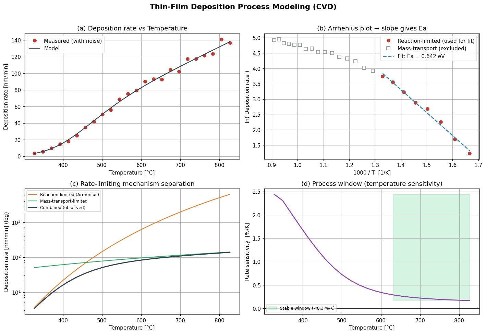

# 박막 증착 공정 파라미터 모델링 (CVD)

> 입문 프로젝트 — 증착률의 온도 의존성 모델링과 Arrhenius 분석을 통한 활성화에너지 추출

## 1. 목표 / 가설

화학기상증착(CVD)에서 박막 증착률이 온도에 어떻게 의존하는지 모델링하고, 다음을 검증한다.

- 저온에서는 표면 반응이 율속이 되어 증착률이 Arrhenius 식을 따른다.
- 고온에서는 반응물 공급(물질전달)이 율속이 되어 온도 의존성이 약해진다.
- Arrhenius 분석으로 활성화에너지 `Ea`를 추출할 수 있다.
- 재현성이 좋은 공정 윈도우를 온도 민감도 기준으로 도출할 수 있다.

## 2. 이론 배경

CVD 증착률은 온도에 따라 두 영역으로 나뉜다.

**(1) 반응 율속 영역 (reaction-limited, 저온)**

표면 화학반응 속도가 전체를 결정한다. 증착률은 Arrhenius 식을 따른다.

```
R = A · exp( −Ea / (k_B · T) )
```

양변에 로그를 취하면 `ln(R) = ln(A) − (Ea/k_B)·(1/T)` 이므로, **ln(R) vs 1/T 그래프의 기울기 = −Ea/k_B** 에서 활성화에너지를 추출한다.

**(2) 물질전달 율속 영역 (mass-transport-limited, 고온)**

반응이 매우 빨라 반응물의 표면 공급(기상 확산)이 율속이 된다. 온도 의존성이 약하다 (`R ∝ T^n`, n ≈ 1.5~2).

두 단계가 직렬로 일어난다고 보면 전체 증착률은 `1/R_total = 1/R_reaction + 1/R_transport` 로 합성되며, 항상 느린 쪽이 율속이 된다.

## 3. 방법

- 도구: Python (numpy, scipy, matplotlib)
- 합성 실험 데이터: 알려진 `Ea = 0.85 eV`로 600~1100 K 범위의 증착률을 생성하고 ±5% 측정 노이즈 추가
- Arrhenius 피팅: 반응 율속 영역(저온부)만 선택해 `ln(R)` vs `1/T` 선형 회귀
- 공정 윈도우: 온도 민감도 `d(lnR)/dT < 0.3 %/K` 인 안정 영역 도출

실제 실험/논문 데이터가 있다면 STEP 1의 합성 데이터 부분만 교체하면 그대로 분석에 사용할 수 있다.

## 4. 결과



- **(a) 증착률 vs 온도**: 저온에서 급격히 증가하다 고온에서 완만해지는 전형적 거동
- **(b) Arrhenius plot**: 저온부는 직선(반응 율속), 고온부는 평탄(물질전달). 직선 기울기에서 Ea 추출
- **(c) 메커니즘 분리**: 두 메커니즘의 교차점이 영역 전환 지점
- **(d) 공정 윈도우**: 약 630~830 °C 구간이 온도 민감도 < 0.3 %/K 로 재현성 우수

피팅 결과 (경계 760 K 기준): **Ea ≈ 0.64 eV, R² ≈ 0.99**

## 5. 핵심 학습 포인트 (고찰)

**영역 구분이 Ea 정확도를 좌우한다.** 반응 율속 영역의 경계를 어디로 잡느냐에 따라 추출되는 Ea가 달라졌다.

| 경계 설정 | 추출 Ea | R² | 사용 점 수 |
|---|---|---|---|
| T < 850 K (느슨) | 0.557 eV | 0.981 | 12 |
| T < 760 K (엄격) | 0.643 eV | 0.991 | 8 |
| (참값) | 0.85 eV | — | — |

경계를 느슨하게 잡으면 물질전달 영향이 섞인 점까지 피팅에 들어가 직선 기울기가 완만해지고 **Ea가 과소평가**된다. 경계를 좁힐수록 참값에 가까워지지만 점 개수가 줄어 통계가 불안정해진다. 이는 실제 실험 데이터 분석에서 그대로 마주치는 트레이드오프이며, "어디까지가 순수 반응 율속 영역인가"를 판단하는 안목이 분석의 핵심임을 보여준다.

## 6. 한계 및 다음 단계

- 현재는 합성 데이터 → 실제 CVD 논문의 증착률-온도 데이터로 재현해 보기
- 압력 의존성 추가 (반응물 분압 → 증착률 모델 확장)
- 박막 두께 균일도(기판 위치별 증착률 분포) 모델링으로 확장
- 추출한 Ea를 문헌값(예: 특정 전구체-기판 조합)과 비교해 메커니즘 추정

## 파일

- `cvd_deposition_model.py` — 전체 분석 코드 (주석 포함)
- `cvd_deposition_analysis.png` — 결과 그래프
